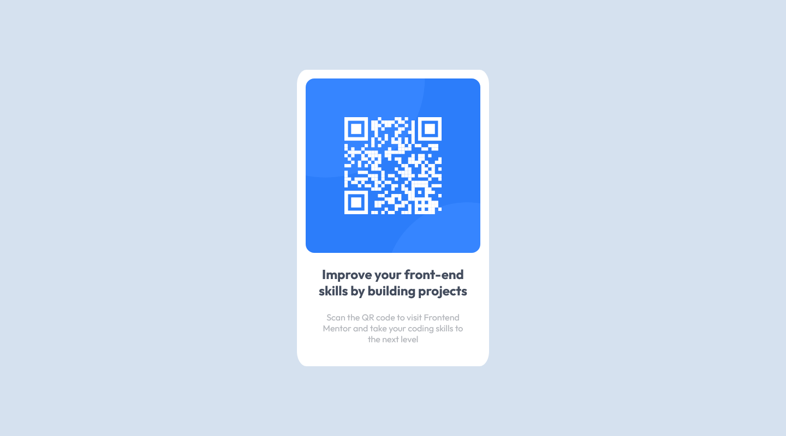

# Frontend Mentor - QR code component solution

This is a solution to the [QR code component challenge on Frontend Mentor](https://www.frontendmentor.io/challenges/qr-code-component-iux_sIO_H). Frontend Mentor challenges help you improve your coding skills by building realistic projects. 

## Table of contents

- [Overview](#overview)
  - [Screenshot](#screenshot)
  - [Links](#links)
- [My process](#my-process)
  - [Built with](#built-with)
- [Author](#author)
- [Acknowledgments](#acknowledgments)

## Overview

### Screenshot

### Links 

- Solution URL: https://github.com/dcosic94/QR-code-component-frontendmentor
- Live Site URL: https://dcosic94.github.io/QR-code-component-frontendmentor

## My process

### Built with

- Semantic HTML5 markup
- CSS
- Flexbox
- Mobile-first workflow

## Author

- Website - [Raw Digital](https://rawdigital.hr)
- Frontend Mentor - [@dcosic94](https://www.frontendmentor.io/profile/dcosic94)

## Acknowledgments

This is a very basic task that can be accomplished with just a little knowledge of HTML and CSS.

